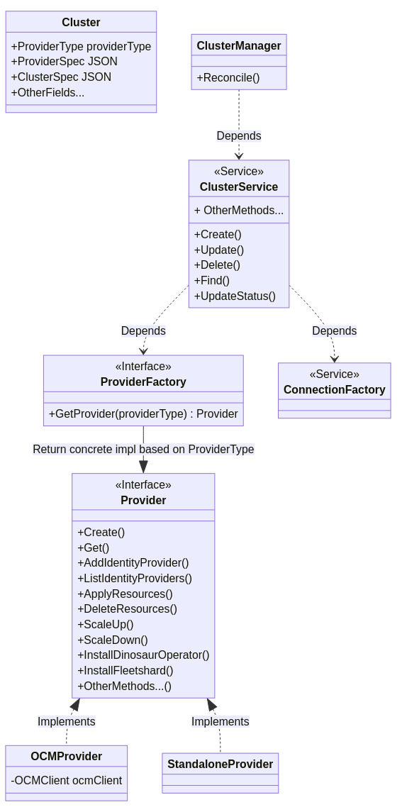

# Cluster Management Interface and Implementations

## Why

1. To improve the architecture if kas-fleet-manager so that when there are changes to OCM, it should only have very small impact on the code base. At the moment, more components are directly depending on OCM than it should be, e.g. [`clusters_mgr.go`](../../pkg/workers/clusters_mgr.go), and this makes it difficult to change the code base if OCM changes.  
2. To allow us easily open source the project. With the right interface/contract in place for cluster management, OCM will just become an implementation detail of the interface. New implementations can then be added by us or the upstream community to support different mechanisms to manage OpenShift/Kubernetes clusters.

## How

The following diagram describes the new architecture for cluster management functions:

Compared to the current implementation, the main changes are:

1. Introducing a new `ClusterProvider` interface. This new interface presents providers of OpenShift/Kubernetes clusters, and we will have two implementations for it: one for OCM, and another for standalone clusters which are already terraformed manually outside of kas-fleet-manager.
2. Adding a new `ClusterRepository` class. This class is responsible for all the database interactions for clusters.
3. Modify the [`ClusterService`](../../pkg/services/clusters.go) class to depend on the new `ClusterProvider` and `ClusterRepository` classes, and remove all dependencies on the OCM client.
4. Modify the [`ClusterManager`](../../pkg/workers/clusters_mgr.go) class to only depend on the `ClusterService`. It should not have any direct dependencies on the OCM clients.

