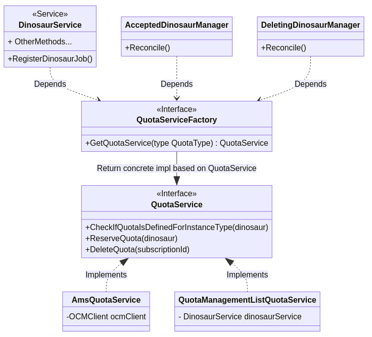

# Quota Service Implementations

## Why

To allow us easily open source the project. With the right interface/contract in place for quota management, 
The AMS (`ams` `QuotaType`) backed quota management implementation is an implementation detail of the interface. 
We have also provided another implentation based on the [allow-list](../../config/allow-list-configuration.yaml).  

## How

When it is enabled, the following diagram describes the architecture for quota management service:

The `QuotaService` is defined in the [services package](../../internal/kafka/internal/services/quota.go). 

The `QuotaServiceFactory` provides the concrete implementation of the `QuotaService` to be used. 
The decision is based on the type provided - an enum, currently accepting `ams` and `allow-list`.
- The `ams` quota service is implemented using OCM. The implementation can be found in [ams_quota_service.go](../../internal/kafka/internal/services/quota/ams_quota_service.go)
- The `allow-list` quota service is implemented using the allow list configuration. The implementation can be found in [ams_quota_service.go](../../internal/kafka/internal/services/quota/allow_list_quota_service.go). The allow list based quota service can be disabled by settting the flag `enable-instance-limit-control` to `false`.

New implementations of the `QuotaService` interface can then be added to support different mechanisms to manage quota.
