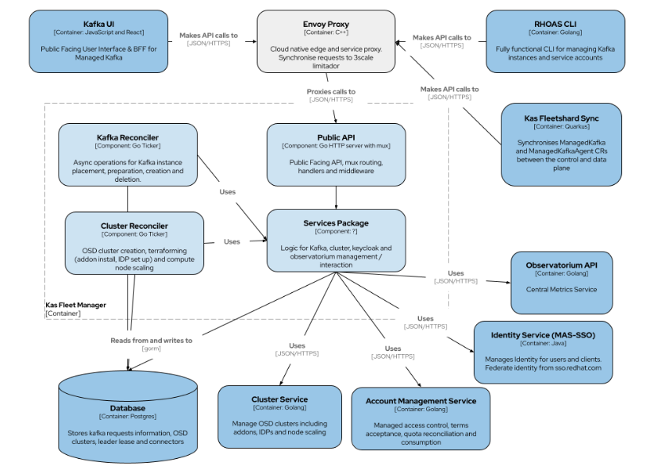

# Implementation

This document is intended to be an overview of the implementation details of the service.

The system is comprised of three main components:

- REST API
- Kafka Worker
- Cluster Worker



## REST API

The system has a REST API for managing Kafka resources. This is the primary interface used by
end-users to communicate with the service.

The OpenAPI spec for this API can be seen by running:

```
make run/docs
```

This will serve the OpenAPI spec on `localhost:80`

It's important to note that the system is asynchronous, meaning that once a Kafka resource is
created via the REST API, there won't be a running Kafka instance created by the time the HTTP
response is sent by the service. A client will need to continue watching or polling their Kafka
resource to determine whether it has a `ready` status or not.

The REST API requires a valid `Authorization` OCM Bearer token header to be provided with all
requests, to obtain a short-lived token run:

```
ocm token
```

## Kafka Workers

The Kafka Workers are responsible for reconciling Kafkas as requested by an end-user. 
There are currently six kafka workers:
- `kafka_mgr.go` responsible for reconciling kafka metrics and performing cleanup of trial kafkas, and cleanup of kafkas of denied owners. 
- `deleting_kafka_mgr.go` responsible for handling the deletion of kafkas e.g removing resources like AWS Route53 entry, Keycloak secrets client
- `accepted_kafka_mgr.go` responsible for checking if user is within Quota before provisioning a kafka. Afterwards, it will periodically reconcile on all pending Kafka resources, attempt to find a valid OpenShift cluster to fit it's requirements (cloud provider, region, etc.) and provision a Kafka instance to the cluster. Once a suitable Dataplane cluster has been found, we'll update the status of the Kafka resource to reflect it's current progress. 
- `preparing_kafka_mgr.go` responsible for creating external resources e.g AWS Route53 DNS, Keycloak authentication secrets 
- `provisioned_kafka_mgr.go` responsible for checking if a provisioned kafka is ready as reported by the fleetshard-operator
- `ready_kafka_mgr` responsible for reconciling external resources of a ready kafka e.g keycloak client and secret

Once the Kafka Workers have set up a Kafka resource, the status of the Kafka request will be `ready`.
If provisioning of a kafka fails, the status will be `failed` and a failed reason will be capture in the database. 
A deleted kafka has a final state of `deleting`, and it will appear in the database as a soft deleted record with a `deleted_at` timestamp different from `NULL`. 

The end-user has no way to directly interact with the Kafka worker, management of Kafka resources should be handled through the REST API.
## Cluster Worker

The Cluster Worker is responsible for reconciling OpenShift clusters and ensuring they are in a
state capable of hosting Kafka instances, this process is referred to as terraforming in this
service.

Once a cluster has been provisioned and terraformed, it is considered capable of hosting Kafka
resources as it's status will be marked as `ready`. This cluster will then be visible to the Kafka
Worker when it is searching for clusters.

The end-user has no way to directly interact with the Cluster Worker.
